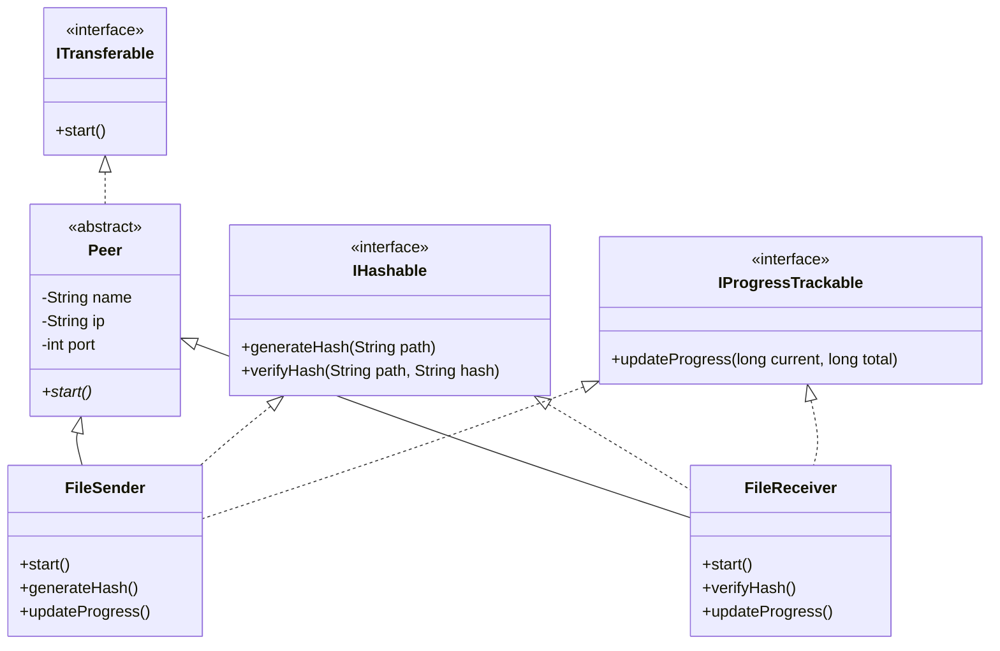

# Blueprint

The construction of Swift follows a strict architectural philosophy which focuses on modularity through interfaces and clean inheritance.

### Technical Architecture

Swift is built on an interface-first design. By defining behaviors as interfaces rather than concrete implementations, the system achieves a high degree of decoupling. This makes the code easier to maintain, extend, and understand.

---

### Implementation Theory

#### Interface-Driven Development
The core functionality of Swift is sliced into three logical domains:
1.  **Network Lifecycle (`ITransferable`)**: Decouples the initiation of a node from the transport mechanism. This allows for future-proofing; if Swift were to migrate from Sockets to NIO, the core logic remains untouched.
2.  **Integrity Control (`IHashable`)**: Separates the cryptographic verification logic from the file I/O. This ensures that the hashing algorithm can be swapped or updated without affecting the network protocol.
3.  **Status Reporting (`IProgressTrackable`)**: Standardizes how the system reports activity. By decoupling progress calculation from the display (System.out), we allow for a seamless transition to a GUI or web-based frontend in the future.

#### Inheritance through the Peer Abstract
The `Peer` class serves as the conceptual anchor for any participant in the network. It encapsulates the shared identity (User Name) and networking parameters (IP/Port), ensuring consistency across both Sender and Receiver roles. Subclassing `Peer` into `FileSender` and `FileReceiver` enforces a specific set of responsibilities while sharing a common foundation.

---

### Libraries and Dependencies

Swift is intentionally designed with zero external dependencies. The entire system is built on the foundation of the Java Standard Library.

- **`java.net`**: Utilized for standard TCP/IP communication. We choose blocking Sockets for this project to maintain structural simplicity and synchronous predictability during the handshake.
- **`java.io`**: Used for high-efficiency streaming. `DataInputStream` and `DataOutputStream` are employed to provide a structured, typed abstraction over the raw byte streams.
- **`java.security`**: Powers the security subsystem. The `MessageDigest` library is used to implement the SHA-256 algorithm, providing a robust defense against data corruption.

---

### Design Decisions

- **Buffer Optimization**: The 64KB (65,536 bytes) buffer size is a deliberate choice. It matches typical modern network card maximum segment sizes (MSS) and kernel window sizes, minimizing context switches during heavy throughput.
- **Package Flattening**: The directory structure is intentionally kept flat (e.g., `core/`, `utils/`) to reduce the navigation tax for developers and to emphasize the project's minimalist character.
